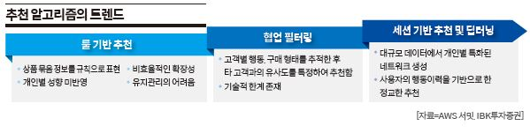

# 추천 시스템의 주요 응용 분야

## 1. 전자상거래 (E-commerce)
- 상품 추천, "함께 구매한 상품" 추천
- 개인화된 상품 목록 제공
- 장바구니 기반 추천

## 2. 미디어/엔터테인먼트
- 영화, TV 프로그램 추천 
- 음악 플레이리스트 추천
- 유튜브 동영상 추천

## 3. 뉴스/콘텐츠
- 개인화된 뉴스 기사 추천
- 블로그 포스트 추천
- 관심사 기반 콘텐츠 큐레이션

## 4. 소셜 네트워크
- 친구/팔로워 추천
- 관심사 기반 그룹 추천
- 이벤트 추천

## 5. 구인구직
- 맞춤형 채용 공고 추천
- 기업에 적합한 인재 추천
- 경력 경로 추천

# 국내 주요 사이트의 추천시스템 활용 현황

## 1. 네이버 (Naver)
- AiRS (AI Recommender System) 도입
- 뉴스, 쇼핑, 동영상 등 전 서비스 영역에서 개인화 추천 제공
- 사용자의 검색, 클릭, 구매 이력 등을 종합적으로 분석
[네이버 뉴스 추천 알고리즘에 대해 (QnA)](https://blog.naver.com/naver_search/222439522292)

## 2. 쿠팡 (Coupang)
- 협업 필터링 기반의 상품 추천 시스템 운영
- "함께 구매하면 좋은 상품" 추천
- 로케이션 기반 배송 시간 최적화와 연계된 추천
[대학생들이 궁금해한 쿠팡 인공지능 & 데이터 사이언스](https://news.coupang.com/archives/29293/)

## 3. 넷플릭스 코리아 (Netflix Korea)
- 콘텐츠 기반 필터링과 협업 필터링의 하이브리드 방식
- 한국 사용자 취향에 맞는 K-콘텐츠 추천
- 시청 시간대, 디바이스 등을 고려한 맞춤형 추천
[넷플릭스의 추천 콘텐츠 시스템 작동 방법](https://help.netflix.com/ko/node/100639)

# REF
https://scholar.archive.org/work/ds5ytz4xnfbptjqg4pkxczcgay/access/wayback/http://www.ndsl.kr/soc_img/society/kiie/SGHHB1/2015/v41n2/SGHHB1_2015_v41n2_185.pdf

https://monthly.newspim.com/news/view/4203/?yymm=2024-11