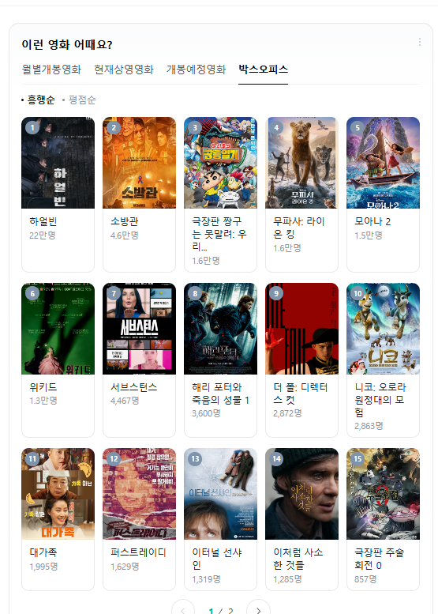
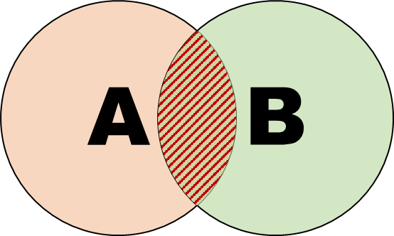
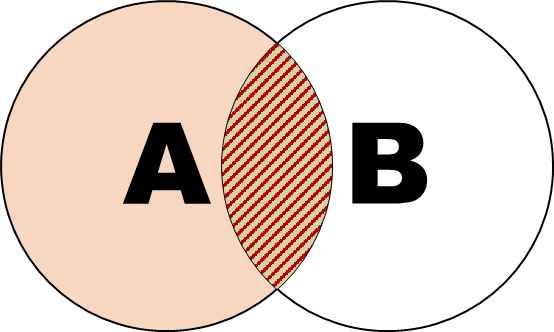

# 목표
- 추천 시스템의 주요 알고리즘 이해

## 통계 기반 추천

### 단점
개인화 불가

## 연관 규칙(Association Rule)
서로 얼마나 연관이 있는지..!
- 장바구니 분석이라고도 함
- 사용자들의 구매 이력을 분석하여 함께 구매되는 상품들의 패턴을 찾아내는 방식
- 예) "맥주를 구매한 사람은 안주도 함께 구매한다" 와 같은 규칙 발견

### 장점
- 이해하기 쉽고 직관적
- 구현이 비교적 간단

### 단점
- 희소한 데이터에서는 성능이 떨어짐

### 주요 지표
- 지지도(Support): 전체 거래 중 규칙이 발생한 비율

  - Support(A→B) = P(A∩B) = (A와 B가 동시에 발생한 거래 수) / (전체 거래 수)
- 신뢰도(Confidence): 조건부 확률로, A를 구매했을 때 B도 구매할 확률

  - Confidence(A→B) = P(B|A) = Support(A∩B) / Support(A)
- 향상도(Lift): 우연히 발생할 확률 대비 실제 발생 비율

  - Lift(A→B) = Confidence(A→B) / Support(B) 
  - P(B|A) / P(B)

> 사건의 독립 조건 p(A∩B) = p(A) * p(B)

## 콘텐츠 기반 필터링(Content-Based Filtering)
아이템의 특성(content)을 분석하여 사용자가 선호했던 아이템과 비슷한 아이템을 추천하는 방식

### 작동 방식
1. 아이템의 특성 추출
   - 영화: 장르, 배우, 감독, 줄거리 키워드 등
   - 음악: 장르, 템포, 악기 구성 등
   - 뉴스: 제목, 본문의 키워드, 주제 등
2. 사용자 프로필 구축
   - 과거 선호했던 아이템들의 특성을 분석
   - 사용자의 선호도 프로필 생성
3. 유사도 계산
   - 코사인 유사도 등을 활용하여 아이템 간 유사도 측정
   - 사용자 프로필과 새로운 아이템 간의 유사도 계산

### 장점
- 다른 사용자의 데이터가 필요 없음 (Cold Start 문제 해결)
- 새로운 아이템도 즉시 추천 가능
- 추천 이유를 설명하기 쉬움
- 틈새(niche) 아이템도 추천 가능

### 단점
- 아이템의 특성을 정확히 추출하기 어려움
- 과적합(overfitting) 위험: 너무 비슷한 아이템만 추천
- 예상치 못한 아이템 발견(serendipity) 부족
- 새로운 사용자에 대한 추천이 어려움

### REF
[카카오톡의 콘텐츠 기반 필터링](https://tech.kakao.com/posts/486)

## 협업 필터링(Collaborative Filtering)

사용자들의 행동 패턴(평점, 구매 이력 등)을 분석하여 비슷한 취향을 가진 사용자들의 선호도를 기반으로 추천하는 방식

### 작동 방식
1. 사용자-아이템 상호작용 데이터 수집
   - 평점, 구매 이력, 클릭, 시청 시간 등
2. 유사도 계산
   - 사용자-사용자 유사도 또는 아이템-아이템 유사도
3. 예측 및 추천
   - 유사한 사용자/아이템의 패턴을 기반으로 선호도 예측

### 주요 접근법
1. 메모리 기반(Memory-based)
   - 사용자 기반(User-based): 비슷한 사용자들이 좋아한 아이템 추천
   - 아이템 기반(Item-based): 사용자가 좋아한 아이템과 비슷한 아이템 추천

2. 모델 기반(Model-based)
   - 행렬 분해(Matrix Factorization)
   - SVD(Singular Value Decomposition)
   - 딥러닝 모델 등

### 장점
- 아이템의 내용을 분석할 필요가 없음
- 예상치 못한 아이템 발견 가능
- 도메인 지식이 필요 없음

### 단점
- Cold Start 문제: 새로운 사용자/아이템에 대한 추천이 어려움
- 데이터 희소성 문제
- 계산 복잡도가 높음

### REF
[카카오톡의 협업 필터링](https://tech.kakao.com/posts/463)

### 행렬 분해 (Matrix Factorization)
협업 필터링의 대표적인 모델 기반 접근법으로, 사용자-아이템 평점 행렬을 저차원의 잠재 요인(latent factor) 행렬로 분해하는 기법

### 작동 방식
1. 사용자-아이템 평점 행렬 R을 두 개의 저차원 행렬 P와 Q로 분해
   - R ≈ P × Q
   - P: 사용자의 잠재 요인 행렬
   - Q: 아이템의 잠재 요인 행렬

2. 최적화 과정
   - 실제 평점과 예측 평점의 차이를 최소화
   - 과적합 방지를 위한 정규화(regularization) 적용

### 장점
- 데이터 희소성 문제 해결
- 확장성이 좋음
- 잠재 요인을 통한 해석 가능성

### 단점
- 하이퍼파라미터 튜닝이 필요
- Cold Start 문제는 여전히 존재
- 최적의 잠재 요인 차원 결정이 어려움

### 주요 변형
- SVD (Singular Value Decomposition)
   > [SVD_실적용_케이스논문](https://www.researchgate.net/publication/2824548_Application_of_Dimensionality_Reduction_in_Recommender_System_--_A_Case_Study)
   > [SVD_설명](https://angeloyeo.github.io/2019/08/01/SVD.html#google_vignette)
- SVD++ (향상된 SVD)
- NMF (Non-negative Matrix Factorization)
- PMF (Probabilistic Matrix Factorization)
- ALS (Alternating Least Squares)

### REF
[인공지능을 위한 기초수학 입문, 행렬분해](http://matrix.skku.ac.kr/math4ai-intro/W6/)
> [Review] 특잇값 분해(SVD)는 행렬을 대각화하는 한 방법이다. 특잇값 분해가 특히 유용한 이유는 행렬이 정사각행렬이든 아니든 관계없이 모든 크기의 행렬에 대해 적용 가능하기 때문이다

> 특잇값 분해는 활용도 측면에서 인공지능에 필요한 선형대수학의 내용 중 가장 중요하다. 더구나 특잇값 분해에 대하여 위에서 학습한 모든 내용은 실수 행렬 뿐만 아니라, 복소수 성분의 행렬에 대하여도 모두 성립한다.

> 특잇값 분해를 이용하여 주어진 큰 크기의 행렬을 인공지능이 쉽게 다룰 수 있는 작은 크기의 행렬로 바꾸는 것이 가능하다는 것이 key 아이디어이다.

[넷플릭스의 행렬 분해 활용 사례](https://netflixtechblog.com/netflix-recommendations-beyond-the-5-stars-part-1-55838468f429)

## 하이브리드 방법(Hybrid Methods)
여러 추천 시스템 방식을 결합하여 각 방식의 장단점을 보완하는 접근법

### 결합 방식
1. 가중치 기반 결합
   - 각 추천 방식의 결과를 가중 평균
   - 상황에 따라 가중치 동적 조정 가능

2. 스위칭 방식
   - 상황에 따라 적절한 추천 방식을 선택
   - 예: Cold Start 상황에서는 콘텐츠 기반으로 전환

3. 계단식 결합
   - 한 방식의 결과를 다른 방식의 입력으로 사용
   - 점진적 필터링 효과

### 장점
- 각 방식의 단점 보완
- 더 정확하고 안정적인 추천
- 다양한 상황 대응 가능

### 단점
- 시스템 복잡도 증가
- 구현과 유지보수 비용 증가
- 최적의 결합 방식 결정이 어려움

### 적용 사례
- 넷플릭스: 콘텐츠 기반 + 협업 필터링
- 아마존: 아이템 기반 협업 필터링 + 콘텐츠 기반
- 유튜브: 딥러닝 + 협업 필터링

### REF
[하이브리드 추천 시스템 설계](https://www.sciencedirect.com/science/article/abs/pii/S0957417418303683)

## 딥러닝 기반의 추천 (Deep Learning)
딥러닝의 발전으로 추천 시스템에서도 딥러닝 기술을 활용하는 사례가 증가하고 있음

### 특징
- 비선형적인 패턴 학습 가능
- 다양한 형태의 데이터(텍스트, 이미지, 오디오 등) 처리 가능
- 잠재 특성을 자동으로 학습
- end-to-end 학습 가능

### 주요 모델
1. Neural Collaborative Filtering (NCF)
   - 기존 협업 필터링을 신경망으로 구현
   - 사용자-아이템 상호작용의 비선형 패턴 학습

2. Deep Neural Networks for YouTube Recommendations
   - 후보 생성 네트워크와 랭킹 네트워크로 구성
   - 사용자의 시청 기록과 검색 기록을 활용

3. Wide & Deep Learning
   - 기억(Wide)과 일반화(Deep)를 결합
   - 구글 플레이 스토어에서 앱 추천에 사용

4. AutoEncoder 기반 추천
   - 데이터의 압축과 복원을 통한 특성 학습
   - 희소한 입력을 다루는데 효과적

### 장점
- 복잡한 패턴 학습 가능
- 다양한 데이터 통합 용이
- 정확도 향상 가능
- 특성 엔지니어링 자동화

### 단점
- 대량의 학습 데이터 필요
- 계산 비용이 높음
- 모델 해석이 어려움
- 과적합 위험

### REF
[Deep Learning based Recommender System: A Survey and New Perspectives](https://arxiv.org/abs/1707.07435)

# 나가며
어떤 모델을 사용할지 고민하는것보다 선행되야하는 것!, "어떤 문제를 풀까?"