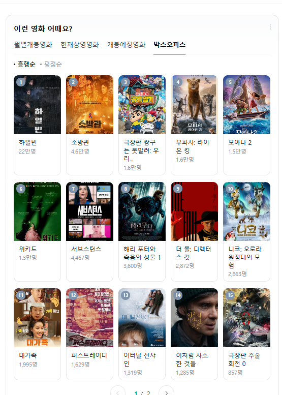

# 목표
- 추천 시스템의 주요 알고리즘 이해

## 통계 기반 추천

### 단점
개인화 불가

## 연관 규칙(Association Rule)
서로 얼마나 연관이 있는지..!
- 장바구니 분석이라고도 함
- 사용자들의 구매 이력을 분석하여 함께 구매되는 상품들의 패턴을 찾아내는 방식
- 예) "맥주를 구매한 사람은 안주도 함께 구매한다" 와 같은 규칙 발견

### 장점
- 이해하기 쉽고 직관적
- 구현이 비교적 간단
- 새로운 아이템에 대해서도 즉시 추천 가능

### 단점
- 계산 비용이 많이 듦
- 희소한 데이터에서는 성능이 떨어짐
- 개인화된 추천이 어려움

### 주요 지표
- 지지도(Support): 전체 거래 중 규칙이 발생한 비율
  - Support(A→B) = P(A∩B) = (A와 B가 동시에 발생한 거래 수) / (전체 거래 수)
- 신뢰도(Confidence): 조건부 확률로, A를 구매했을 때 B도 구매할 확률
  - Confidence(A→B) = P(B|A) = Support(A∩B) / Support(A)
- 향상도(Lift): 우연히 발생할 확률 대비 실제 발생 비율
  - Lift(A→B) = Confidence(A→B) / Support(B) = P(B|A) / P(B)

> 사건의 독립 조건 p(A∩B) = p(A) * p(B)

## 콘텐츠 기반 필터링(Content-Based Filtering)
아이템의 특성(content)을 분석하여 사용자가 선호했던 아이템과 비슷한 아이템을 추천하는 방식

### 작동 방식
1. 아이템의 특성 추출
   - 영화: 장르, 배우, 감독, 줄거리 키워드 등
   - 음악: 장르, 템포, 악기 구성 등
   - 뉴스: 제목, 본문의 키워드, 주제 등
2. 사용자 프로필 구축
   - 과거 선호했던 아이템들의 특성을 분석
   - 사용자의 선호도 프로필 생성
3. 유사도 계산
   - 코사인 유사도 등을 활용하여 아이템 간 유사도 측정
   - 사용자 프로필과 새로운 아이템 간의 유사도 계산

### 장점
- 다른 사용자의 데이터가 필요 없음 (Cold Start 문제 해결)
- 새로운 아이템도 즉시 추천 가능
- 추천 이유를 설명하기 쉬움
- 틈새(niche) 아이템도 추천 가능

### 단점
- 아이템의 특성을 정확히 추출하기 어려움
- 과적합(overfitting) 위험: 너무 비슷한 아이템만 추천
- 예상치 못한 아이템 발견(serendipity) 부족
- 새로운 사용자에 대한 추천이 어려움

### REF
[카카오톡의 콘텐츠 기반 필터링](https://tech.kakao.com/posts/486)

## 협업 필터링(Collaborative Filtering)

사용자들의 행동 패턴(평점, 구매 이력 등)을 분석하여 비슷한 취향을 가진 사용자들의 선호도를 기반으로 추천하는 방식

### 작동 방식
1. 사용자-아이템 상호작용 데이터 수집
   - 평점, 구매 이력, 클릭, 시청 시간 등
2. 유사도 계산
   - 사용자-사용자 유사도 또는 아이템-아이템 유사도
3. 예측 및 추천
   - 유사한 사용자/아이템의 패턴을 기반으로 선호도 예측

### 주요 접근법
1. 메모리 기반(Memory-based)
   - 사용자 기반(User-based): 비슷한 사용자들이 좋아한 아이템 추천
   - 아이템 기반(Item-based): 사용자가 좋아한 아이템과 비슷한 아이템 추천

2. 모델 기반(Model-based)
   - 행렬 분해(Matrix Factorization)
   - SVD(Singular Value Decomposition)
   - 딥러닝 모델 등

### 장점
- 아이템의 내용을 분석할 필요가 없음
- 예상치 못한 아이템 발견 가능
- 도메인 지식이 필요 없음

### 단점
- Cold Start 문제: 새로운 사용자/아이템에 대한 추천이 어려움
- 데이터 희소성 문제
- 계산 복잡도가 높음

### REF
[카카오톡의 협업 필터링](https://tech.kakao.com/posts/463)

### 행렬 분해 (Matrix Factorization)

## 하이브리드 방법(Hybrid Methods)

## 딥러닝 기반의 추천 (Deep Learning)

# 나가며
어떤 모델을 사용할지 고민하는것보다 선행되야하는 것!, "어떤 문제를 풀까?"